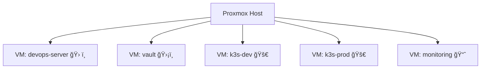

# 221B-doc
Global documentation about the server

```mermaid
graph TD
    Proxmox[Proxmox Host] --> DevOpsVM[VM: devops-server 🛠ï¸]
    Proxmox --> VaultVM[VM: vault 🛡ï¸]
    Proxmox --> K3sDev[VM: k3s-dev 🚀]
    Proxmox --> K3sProd[VM: k3s-prod 🚀]
    Proxmox --> MonitoringVM[VM: monitoring 📈]
```
